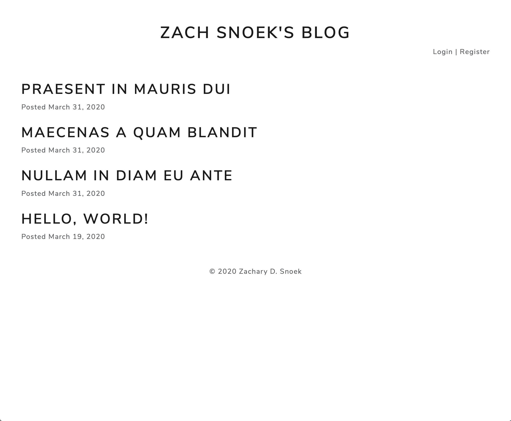
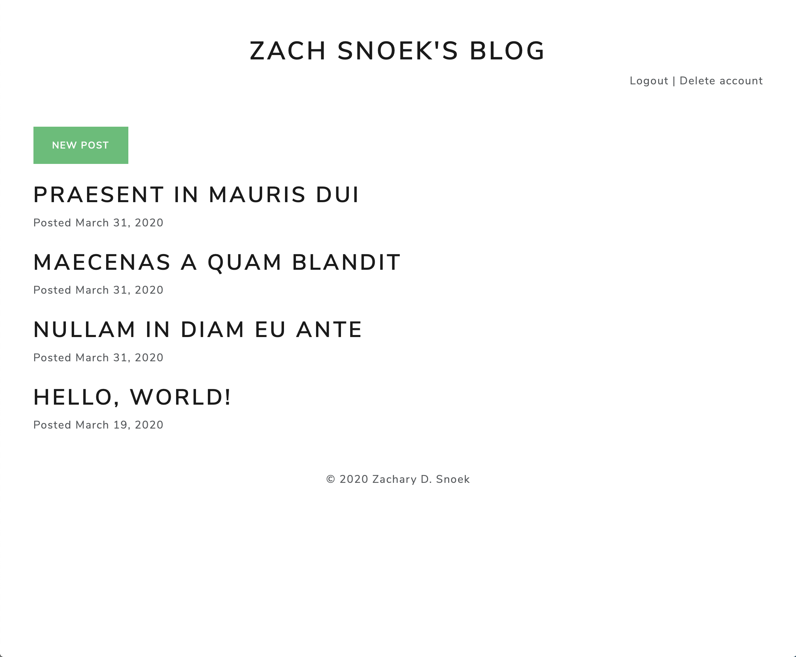
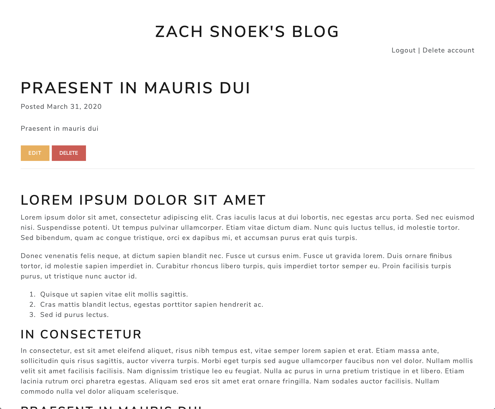
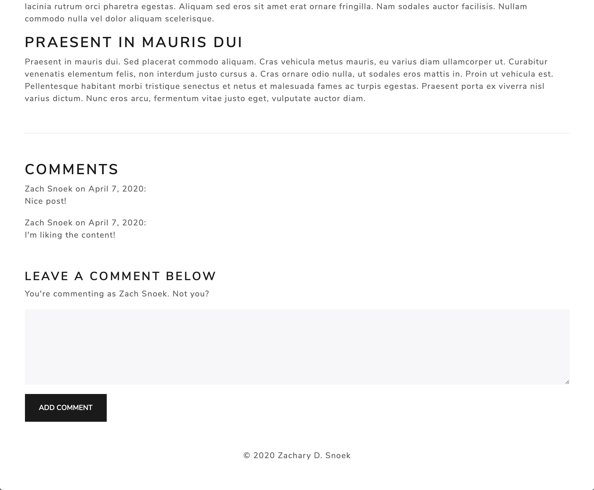
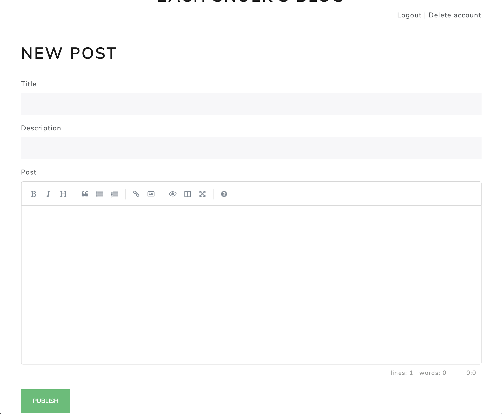
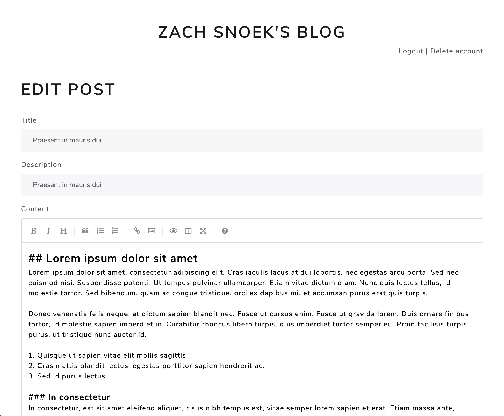

# simple-blog

## Description
A Node.js blog that features simple user authentication. The author of the blog is able to create, edit, and delete posts; registered users are able to comment on posts. The text of the blog is created and stored as markdown, and is rendered as HTML when a post is requested.

## Setup
1. Configure `DATABASE_URL` and `SESSION_SECRET` in `.env`
2. Run `npm i`
3. Start MongoDB

## Usage
`$ node app.js`

## Images
_Home page with no user logged in_

_Home page with admin logged in_

_Post with admin logged in_

_Comment section on post with user logged in_

_New post page for admin_

_Edit post page for admin_

